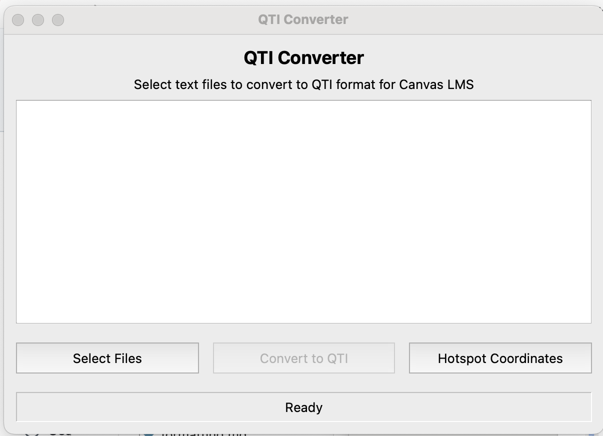

# QTI converter

This program will convert a simply formatted text (.txt or .md) document containing most question types available in Canvas into a zip file that can be imported to Canvas to add the questions to a question bank or as a quiz.
This is updated to work with some of the more modern formats of questions available in "New Quizzes" like "hotspot" and "categorization". It *should* still be backward compatible with classic quizzes as long as you stick to question types found there. 

NOTE: With the classic quizzes Canvas import process will also make an actual quiz containing all of the questions in the bank. If you just want the question bank to pull from, I suggest deleting that quiz after import.

+ Written by Brandon E. Jackson, Ph.D.  
+ last updated: 2025-04-30  

## Installation and Usage
For more details click on the link for each step.

1. [Installation:](./docs/installation.md) - download a packaged app or run from the command line
2. [Preparing the document](docs/formatting.md) - make a markdown (or text) file that includes the questions, answers, and links to images
3. [Importing to Canvas](docs/importing.md) - import the output to a specific quiz or to a question bank in Canvas
4. [Tips and FAQ](docs/FAQ.md) - Help, common causes of errors, etc
5. [Sample question formatting](docs/samples.md) - samples of every question type to demonstrate formatting

## Question types supported
Note: All question types support images as part of the question.

+ Multiple choice 
  + includes support for images in the answer options
+ Multiple answer (i.e. "select all that apply")
  + includes support for images in the answer options
+ Fill in the blank 
  + includes support for multiple blanks as "open answer" asking students to type in answers. You can define multiple acceptable answers per blank.
  + Also "dropdown" multiple blanks where you can define a list of choices per blank. Formerly this was the "multiple dropdown" question type, but in new quizzes, it's an option under Fill in the blank.
+ Matching
+ Ordering
+ True/False
+ Categorization
+ Hot Spot (i.e. click on the part of the image where...)
  + This repository includes a small script that lets you load an image and define the region that is "correct" for this question type
+ Essay
  
## Quick tutorial video

<iframe src="https://www.loom.com/embed/c2cfa3972dc845dea699e076b0ab529d?sid=e705131f-cabf-4963-9559-02b2d202eeef" frameborder="0" webkitallowfullscreen mozallowfullscreen allowfullscreen style="position: absolute; top: 0; left: 0; width: 100%; height: 100%;"></iframe>

## License

This project is licensed under the GNU Lesser General Public License v3.0; see the LICENSE.md file for details. Note that the software is provided "as is", without warranty of any kind, express or implied.
